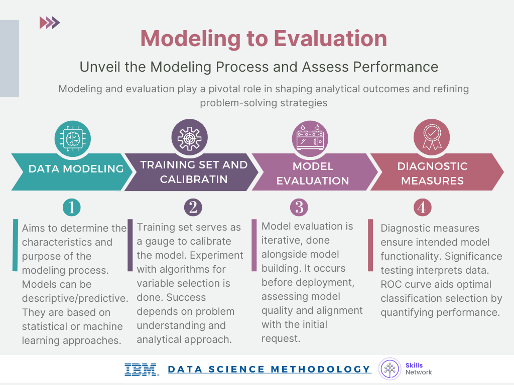

## Data Science Methodology Overview

* **Methodology Definition:** A system of methods used in a particular area of study that provides guidelines for decision-making in the scientific process.
* **Data Science Methodology:** Structured approach guiding data scientists in solving complex problems and making data-driven decisions.
* **Components of Data Science Methodology:**
  * Data collection forms
  * Measurement strategies
  * Comparisons of data analysis methods
* **Importance of Methodology:** Provides practical guidance for efficient scientific research, preventing hasty solutions.
* **John Rollins Contribution:** Outlined a 10-stage methodology for successful data science outcomes.

## 10 Stages of Data Science Methodology

1. Business understanding
2. Analytic approach
3. Data requirements
4. Data collection
5. Data understanding
6. Data preparation
7. Modeling
8. Evaluation
9. Deployment
10. Feedback

## 10 Basic Questions in Data Science Methodology

1. What is the problem to solve?
2. How can data answer the question?
3. What data is needed?
4. Where is the data sourced?
5. Is the collected data representative?
6. What additional data manipulation is required?
7. Do visualizations address the problem?
8. Does the data model answer the question?
9. Can the model be implemented?
10. Are feedback mechanisms in place?

## Business Understanding

* **Importance of Business Understanding:**

  * Clarify the problem to be solved to determine relevant data.
  * A clearly defined question directs the analytic approach.
  * Understanding the goal of the questioner is crucial.
* **Defining Goals and Objectives:**

  * Identify objectives that support the goal.
  * Structured discussions prioritize and plan problem-solving strategies.
  * Engage different stakeholders to clarify requirements.
* **Case Study - Allocating Healthcare Budget:**

  * Question: How to maximize healthcare budget for quality care?
  * Goals and Objectives:
  * "Patient readmissions" prioritized for review.
  * 30% readmitted within a year; 50% within five years.
  * Congestive heart failure patients top the readmission list.
  * Decision-tree model used to analyze the scenario.
* **Business Requirements:**

  * Predict readmission outcomes for Congestive Heart Failure patients.
  * Predict readmission risk.
  * Understand the events leading to predicted outcomes.
  * Apply an easy-to-understand process for new patient readmission risk.
* **Key Points:**

  * To achieve a successful data science project, a thorough understanding of the business problem is essential.
  * Business understanding involves collaborating with stakeholders to define the problem and its objectives clearly.
  * Effective communication with domain experts and decision-makers is critical for aligning data analysis with business goals.
* **Steps in Business Understanding:**

  * Identify stakeholders and gather their requirements.
  * Define the business problem and the expected outcome.
  * Analyze existing data sources and potential data requirements.
  * Ensure alignment between business objectives and data analytics strategies.
* **Importance of Clarity:**

  * A well-defined problem statement helps in selecting appropriate data analysis techniques.
  * Understanding the underlying business context leads to actionable insights and informed decision-making.
  * Clear objectives enable effective evaluation of the success of the data science project.

## Analytic Approach

* **Selecting Analytic Approach:**

  * The choice of analytic approach hinges on the specific question at hand.
  * Clarification from the question asker is crucial to ensure the right approach is chosen.
* **Types of Analytic Approaches:**

  * If determining probabilities, a predictive model is suitable.
  * For showing relationships, a descriptive approach is necessary.
  * Statistical analysis is apt for count-based problems.
  * Classification models are used for answering yes/no questions.
* **Machine Learning:**

  * Machine Learning enables computers to learn patterns without explicit programming.
  * Helpful in identifying hidden relationships and trends in data.
  * Uses clustering association approaches.
* **Case Study on Analytic Approach:**

  * Decision tree classification model applied for patient outcome assessment.
  * Model provides predicted outcome and likelihood based on variables and thresholds.
  * Easy for non-experts to comprehend and utilize for risk assessment in healthcare.
* **Decision Tree Classification:** *

  * Categorical outcome
  * Explicit "decision path" showing conditions leading to high risk
  * Likelihood of classified outcome
  * Easy to understand and apply
* **Machine Learning Types:**

  * **Cluster Analysis:** Used to group similar activities based on events and preferences.
  * **Association Analysis:** Suitable for understanding human behavior patterns.
* **Decision Tree Classification Model:**

  * Provides a clear visualization of the decision-making process.
  * Offers insights into the factors influencing specific outcomes.
* **Benefits of Decision Tree Models:**

  * Easy interpretation for medical professionals in identifying patient risks.
  * Allow for the dynamic monitoring of patient outcomes over time.
* **Application in Healthcare:**

  * Decision tree models aid in predicting readmission risks and improving patient care.
  * Enable clinicians to adjust treatments based on evolving risk assessments.

## Data Requirements

**Introduction to Data Science Methodology 101**:
In data science, understanding data requirements is crucial, akin to cooking with data where each step is essential in achieving the desired outcome.

**Identifying Required Ingredients**:

- Identify which ingredients (data) are needed for the problem at hand.
- Determine how to source or collect the data.
- Understand and work with the data.
- Prepare the data to meet the desired objective.

**Data Requirements for Decision Tree Classification**:

- Define necessary data content, formats, and sources for initial collection.

**Case Study: Applying "Data Requirements"**:

- Define data requirements for decision tree classification.
- Select a suitable patient cohort from health insurance providers' member base.
- Establish inclusion criteria: in-patient admission, primary diagnosis of congestive heart failure, continuous enrollment for at least six months.
- Exclude patients with other significant medical conditions to avoid skewing results.

**Representation of Data for Decision Tree Classification**:

- Each record represents a patient with columns for model variables.
- Data includes clinical histories, admissions, diagnoses, procedures, prescriptions, and other services provided.
- Transactional records are aggregated to the patient level to ensure one record per patient.

## Data Collection

**Initial Assessment:** Data scientist assesses collected data to ensure all necessary information is available.

**Revision of Data Requirements:** Adjustments made based on availability and quality of collected data.

**Data Understanding:** Utilize descriptive statistics and visualization to analyze dataset.

* Assess content, quality, and derive initial insights.

**Identifying Gaps:** Identify missing data and develop plans to address them.

**Case Study Example:** Applying data collection within a specific context.

**Key Data Elements:** Include demographic, clinical, and provider information, claims records, and drug-related data.

**Deferring Decisions:** It is acceptable to postpone decisions on unavailable data and gather it later, based on need.

**DBAs and Programmers:** Collaborate to extract and merge data from multiple sources, eliminating redundancies.

**Automating Processes:** Implement automation in database management to streamline data collection.

### Importance of Data Quality

* **Data Validity:** Ensure data accuracy and reliability for meaningful analysis.
* **Data Consistency:** Ensure uniformity and integrity across datasets for reliable insights.
* **Data Completeness:** Ensure all necessary data elements are present to avoid gaps in analysis.
* **Data Timeliness:** Ensure data is up-to-date for relevance in decision-making processes.

## Data Understanding

* **Data Set Construction:** Data understanding involves constructing the data set. Verify if collected data is representative of the problem to be solved.
* **Descriptive Statistics:**
  * Run descriptive statistics on data columns to be used as variables. Include measures like mean, median, min, max, and standard deviation.
  * Use hurst and univariates to understand the data.
* **Pairwise Correlations:**
  * Examine how closely variables are related.
  * Identify highly correlated variables, possibly indicating redundancy.
* **Histogram Examination:** Study variable distributions using histograms to prepare data for modeling.
  * Understand data distribution and plan necessary data preparations.
  * Consolidate values in categorical variables with excessive distinct values.
* **Assessing Data Quality:**
  * Recode or remove values, such as missing data where the meaning must be deciphered.
  * Ensure data correctness and validity for effective analysis.
* **Data Definition Refinement:** Iteratively refine data definitions based on insights gained from the data, improving the model's effectiveness.

## Data Preparation

* **Data Preparation Overview:**
  * Data preparation removes unwanted elements from the dataset, similar to washing vegetables before cooking.
  * It is the most time-consuming phase in data science projects, often taking up to 70-90% of the total project time.
  * Automating data collection and preparation processes can significantly reduce time, allowing more focus on creating models.
* **Data Transformation:**
  * Data transformation makes the data easier to work with by cleaning missing or invalid values, removing duplicates, and ensuring proper formatting.
* **Feature Engineering:**
  * Feature engineering involves using domain knowledge to create features that enhance machine learning model performance.
  * Features are important characteristics that influence predictive models and the desired outcomes.
* **Text Analysis and Preparation:**
  * Text analysis involves coding the data for manipulation, especially when working with textual data.
  * Proper text analysis ensures correct groupings and uncovers hidden insights within the data.
* **Importance of Data Preparation:**
  * Data preparation sets the foundation for successful data analysis and model building.
  * Skipping this critical phase can lead to subpar results and potential setbacks in the project.
  * Automate common data preparation steps and pay attention to detail to ensure high-quality outcomes.

## Modeling

* **Purpose of Data Modeling:** Data modeling aims to develop descriptive or predictive models. Descriptive models analyze if-then scenarios, while predictive models produce yes/no outcomes.
* **Characteristics of Data Modeling:**
  * Models can be statistically or machine learning driven.
  * Training sets are used for predictive modeling to calibrate the model.
  * Data compilation, preparation, and modeling success depend on understanding the problem and applying the appropriate analytic approach.
  * Constant refinement and tweaking within each step are crucial for a solid outcome.
* **Descriptive Data Science Methodology:** Three key aspects - understanding the question, selecting an analytic method, and obtaining, understanding, preparing, & modeling the data.
* **Model Evaluation:** Ensures relevance of the data model by deploying and incorporating feedback loops for continuous improvement.

## Evaluation

**Model Evaluation Process:**

* Iterative process of building and evaluating models
* Performed during model development and before deployment
* Assesses quality and alignment with initial request

**Phases of Model Evaluation:**

* **Diagnostic Measures Phase:**
  * Ensures the model is working as intended
  * Use decision trees for predictive models to assess model outputs
  * For descriptive models, apply known testing sets for refinement
* **Statistical Significance Testing:**
  * Validates data handling and interpretation in the model
  * Avoids uncertainties during model outcome interpretation

**Finding Optimal Model:**

* Tune parameters like misclassification costs to optimize the model
* Assess trade-offs between true-positive and false-positive rates
* Optimal model achieves maximum separation in ROC curve representation

**Receiver Operating Characteristic (ROC) Curve:**

* Quantifies model performance in binary classification
* Measures true-positive rate against false-positive rate
* Helps in selecting the most effective classification model

## Deployment

* Deployment makes the answer of a data science model relevant and useful to address the initial question.
* Stakeholders involved in deploying a model include the solution owner, marketing, application developers, and IT administration.
* The model is evaluated, deployed, and tested in limited user groups or a test environment.
* Case study: Knowledge assimilation for designing and managing an intervention program to reduce readmission risk.
  * Automated, real-time risk assessment tools were desired by the clinical staff, accessible through a tablet-based application.
  * Patient data generated during the hospital stay is automatically prepared for real-time risk scoring near discharge.
  * Training for clinical staff and processes for tracking patient intervention were developed collaboratively with IT teams.
  * A solution deployed through a Cognos application involved the hospitalization risk for patients with juvenile diabetes using decision tree classification.
  * Interactive analysis of national hospitalization risk with detailed reports on predicted risk by patient conditions for clinicians.
  * Detailed summary reports on individual patient risk and clinical history for doctors' reference.

## Feedback

**User Feedback:** Refines the model and assesses performance and impact.

**Model Value:** Depends on successful incorporation of feedback and ongoing adjustments.

* Data Science Methodology is cyclical, facilitating refinement at each stage.
* Feedback process driven by continuous curiosity.

**Model Evaluation:** Deployed and tested in real-time field use.

**Feedback Plan:**

1. Define review process with emphasis on "flying to risk" model for congestive heart failure risk population.
2. Track patients receiving intervention and record re-admission outcomes.
3. Assess intervention effectiveness in reducing re-admissions by comparing pre- and post-implementation readmission rates.

**Evaluation:**

* Publicly available data used to ensure ethical comparisons without controlled and treatment groups.
* Impact measurement reviewed after a year of implementation; model refined based on results.

**Further Refinements:**

* Incorporate participation information and detailed pharmaceutical data into the model.
* Consider additional modifications revealed during the feedback stage.
* Review and refine intervention actions based on initial deployment and feedback experience.

**Redeployment:**

* Refined model and intervention actions redeployed with continued feedback throughout the program's life.

## Storytelling

* **Role of Storytelling:** The art of storytelling is essential in the life of a data analyst as it allows for effective communication of insights derived from data.
* **Importance:** Humans naturally perceive and understand the world through stories, making storytelling crucial in conveying complex data insights.
* **Developing a Story:** Data analysts benefit from developing stories to enhance their understanding of underlying datasets and communicate findings effectively.
* **Balance:** Finding a balance between simplicity and complexity in storytelling is vital to ensuring clear communication of data insights.
* **Communication Strategy:** Communicating data effectively requires telling a clear, concise, and compelling story to resonate with the audience, emphasizing the need for visual aids and storytelling.
* **Essential Skill Set:** Storytelling is a critical skill for data professionals, as it is the final stage in communicating data insights and extracting value from data.
* **Impact:** Storytelling is crucial in data and analytics as it creates an emotional connection, ensuring that information resonates and drives actionable outcomes.
